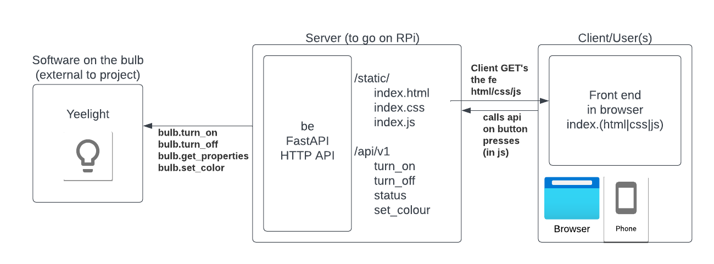

# Yeelight Web App

## Description

This web app contains two components:
* An HTTP API backend written in python using FastAPI
* A frontend written in plain JS/HTML/CSS

The goal is to allow a user (person on the local network) to access the frontend and be able to control a yeelight LED strip (which is also on the network).

The frontend should have buttons allowing the user to:
* Turn on the yeelight
* Turn off the yeelight
* Get the status of the yeelight (brightness, colour, power state)
* Set the colour of the yeelight
* Set the brightness of the yeelight

The backend should implement API endpoints to accomodate the above buttons with endpoints like:

* GET `/api/v1/status`
  * Returns a `Status` object in JSON
    * like `{"colour": [255, 0, 0], "brightness": 100, "power_state": true}`
* POST `/api/v1/turn_on`
  * No body
  * Turns the yeelight on
  * Returns confirmation string
* POST `/api/v1/turn_off`
  * No body
  * Turn the bulb off
  * Returns confirmation string
* POST `/api/v1/set_colour`
  * Query parameters for `red` `green` and `blue` values is a list of rgb values (ints, 0-255)
    * like `[255, 0, 0]`
  * Sets the colour of the bulb to the colour described in the body
  * Returns confirmation string    
* POST `/api/v1/set_brightness`
  * warning: scope creep - this was not in the original spec/discussions
  * `brightness` query parameter of the request is an integer (0-100) representing brightness levels
  * Sets the brightness of the bulb
  * Returns confirmation string

## Design

Here is a basic design overview diagram:

## Next steps

1. Install the `yeelight` library for Python:
   - ~~Task: Run `pip install yeelight` in the terminal to install the required library to control the Yeelight LED strip.~~

2. Import the library and discover the bulb:
   - ~~Task: Import the `yeelight` library by adding `from yeelight import Bulb` at the beginning of the server code.~~
   - ~~Task: Write a function named `discover_bulb` that uses the `yeelight` library to discover the Yeelight LED strip. You can follow the documentation~~: [https://yeelight.readthedocs.io/en/latest/](https://yeelight.readthedocs.io/en/latest/)

3. Store the discovered bulb as a global variable:
   - ~~Task: Create a global variable named `bulb` and assign the discovered bulb instance to it. Make sure to call the `discover_bulb` function to initialize the `bulb` variable.~~

4. Implement the `status()` function:
   - Task: Use the `bulb` variable to get the properties of the LED strip, such as its name, power status, brightness, and color. Return these properties as an instance of the `Status` class.

5. Implement the `turn_on()` function:
   - Task: Use the `bulb` variable to turn on the LED strip by calling the appropriate method from the `yeelight` library.

6. Add a new endpoint for turning off the LED strip:
   - Task: Add a new FastAPI endpoint named `turn_off` that handles a POST request to `/api/v1/turn_off`. In this function, use the `bulb` variable to turn off the LED strip by calling the appropriate method from the `yeelight` library.

7. Implement the frontend `turnOff()` function:
   - Task: In the frontend JavaScript code, create a new function named `turnOff()` that makes a POST request to `/api/v1/turn_off` and displays the response in a new response span.

8. Add a new button for turning off the LED strip:
   - Task: In the HTML file, add a new button with the `onclick` attribute set to `turnOff()` to trigger the `turnOff()` function when clicked.

9. Add a new endpoint for setting the color of the LED strip:
   - Task: Add a new FastAPI endpoint named `set_color` that handles a POST request to `/api/v1/set_color`. This function should accept the color as a parameter and use the `bulb` variable to change the color of the LED strip by calling the appropriate method from the `yeelight` library.

10. Implement the frontend `setColor()` function:
    - Task: In the frontend JavaScript code, create a new function named `setColor()` that takes a color as a parameter, makes a POST request to `/api/v1/set_color`, and displays the response in a new response span.

11. Add a new input field and button for setting the color of the LED strip:
    - Task: In the HTML file, add a new input field for entering the color and a button with the `onclick` attribute set to `setColor(color)` to trigger the `setColor()` function when clicked.
